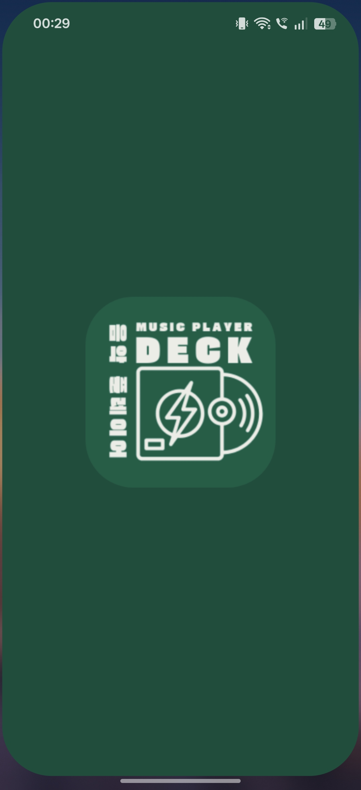
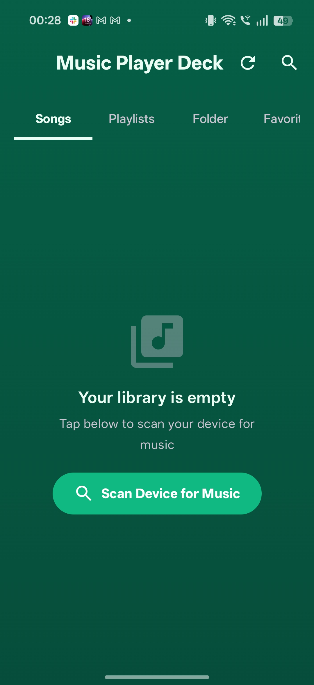
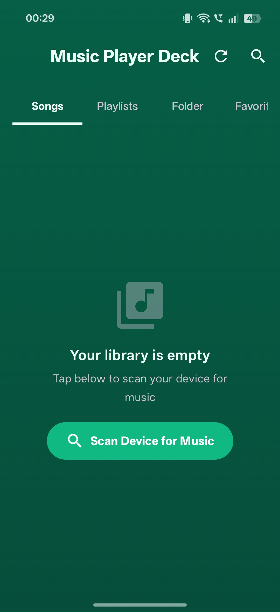
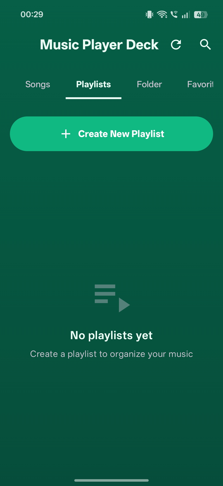
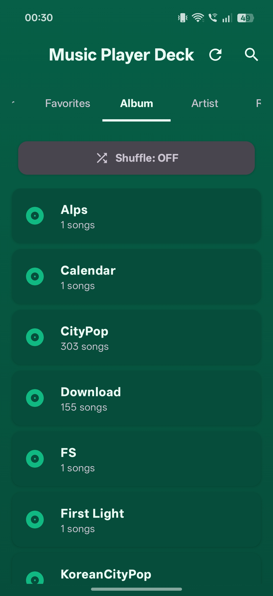

# Music Player Deck 🎵

A modern, feature-rich offline music player for Android built with Jetpack Compose and Media3. Designed with a clean mint-green aesthetic and Japanese-inspired branding.

## Screenshots

<div align="center">
  
  
  
  
  
</div>

## Features

### Playback
- Full background playback using Media3 ExoPlayer and MediaSession
- Play, pause, skip, previous, and seek controls
- Shuffle mode with reshuffle option
- Mini player with seek bar and time labels
- Full-screen Now Playing view with album art dominant color gradient
- Swipe mini player up to expand, swipe down to collapse

### Library Organization
- Browse by Songs, Folders, Albums, and Artists
- Favorites system with heart toggle and swipe-to-favorite
- Custom playlists with drag-to-reorder editing
- Folder-linked playlists with auto-sync on refresh
- Recently Played history
- Most Played / Top Tracks
- Global search across songs, artists, and albums

### Sorting & Filtering
- Sort by name, artist, duration, recently added, or most played
- Available in all tabs and group detail views
- Song count and total duration shown on group headers

### Batch Operations
- Batch select mode to pick multiple songs at once
- Add selected songs to any playlist in one tap
- Select all / deselect all toggle
- Available across Songs, Favorites, Folders, Albums, Artists, Recent, and Top tabs

### Playlist Management
- Create playlists with search and folder-based selection
- Drag-to-reorder songs within a playlist
- Remove songs from playlists in edit mode
- Delete playlists with confirmation dialog
- Auto-sync: playlists created from folders automatically pick up new songs on library refresh

### UI & Design
- Mint green gradient theme with dark mode support
- Animated equalizer bars on currently playing song
- Swipe right to favorite, swipe left to add to queue
- Empty states with friendly icons and messages
- Dominant color extraction from album art for Now Playing screen
- Marquee scrolling for long song titles
- Edge-to-edge display with splash screen

### Library Management
- Scan device for music files
- Refresh button to rescan and pick up new songs
- Sorted alphabetically by default
- Album art display from MediaStore
- Supports RELATIVE_PATH on Android 10+ for accurate folder names

## Tech Stack

- **Language:** Kotlin
- **UI:** Jetpack Compose with Material 3
- **Playback:** AndroidX Media3 (ExoPlayer + MediaSession)
- **Image Loading:** Coil
- **Color Extraction:** AndroidX Palette
- **Drag Reorder:** sh.calvin.reorderable
- **Collections:** kotlinx.collections.immutable
- **Architecture:** ViewModel + Compose state management
- **Storage:** SharedPreferences with JSON serialization

## Project Structure

```
app/src/main/java/com/example/musicplayerdeck/
├── MainActivity.kt
├── data/
│   ├── model/
│   │   ├── Song.kt
│   │   └── Playlist.kt
│   └── repository/
│       ├── SongRepository.kt
│       ├── PlaylistRepository.kt
│       └── HistoryRepository.kt
├── service/
│   └── PlaybackService.kt
├── viewmodel/
│   └── MusicPlayerViewModel.kt
├── util/
│   ├── FormatUtils.kt
│   └── DominantColor.kt
└── ui/
    ├── components/
    │   ├── AnimatedEqualizer.kt
    │   ├── EmptyState.kt
    │   ├── EnhancedShuffleToggle.kt
    │   ├── GroupItem.kt
    │   ├── SongItem.kt
    │   ├── MiniPlayer.kt
    │   └── SortDropdown.kt
    ├── screens/
    │   ├── MainScreen.kt
    │   ├── NowPlayingScreen.kt
    │   ├── CreatePlaylistScreen.kt
    │   └── tabs/
    │       ├── SongsTab.kt
    │       ├── FavoritesTab.kt
    │       ├── PlaylistsTab.kt
    │       └── GroupedTab.kt
    └── theme/
        ├── Color.kt
        ├── Theme.kt
        └── Type.kt
```

## Dependencies

```groovy
// Media3
implementation("androidx.media3:media3-exoplayer:1.x.x")
implementation("androidx.media3:media3-session:1.x.x")

// Compose
implementation(platform("androidx.compose:compose-bom:2024.x.x"))
implementation("androidx.compose.material3:material3")
implementation("androidx.compose.material:material-icons-extended")

// Image loading
implementation("io.coil-kt:coil-compose:2.x.x")

// Color extraction
implementation("androidx.palette:palette-ktx:1.0.0")

// Drag reorder
implementation("sh.calvin.reorderable:reorderable:2.4.2")

// Immutable collections
implementation("org.jetbrains.kotlinx:kotlinx-collections-immutable:0.3.x")

// Splash screen
implementation("androidx.core:core-splashscreen:1.0.x")
```

## Permissions

```xml
<uses-permission android:name="android.permission.READ_MEDIA_AUDIO" />
<uses-permission android:name="android.permission.READ_EXTERNAL_STORAGE" />
<uses-permission android:name="android.permission.POST_NOTIFICATIONS" />
<uses-permission android:name="android.permission.FOREGROUND_SERVICE" />
<uses-permission android:name="android.permission.FOREGROUND_SERVICE_MEDIA_PLAYBACK" />
```

## Getting Started

1. Clone the repository
2. Open in Android Studio
3. Sync Gradle dependencies
4. Run on a device or emulator with music files
5. Grant audio permissions when prompted
6. Tap "Scan Device for Music" to load your library

## Minimum Requirements

- Android 7.0 (API 24) and above
- Android Studio Hedgehog or newer
- Kotlin 1.9+

## License

This project is for personal/educational use.

---

*音楽プレーヤー — Music Player Deck*